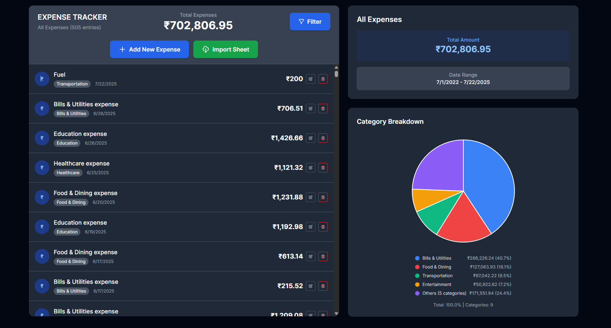

# 💰 Expense Tracker

My submission for Valar Digital assignment



## ✨ Features

**Expense Management**
- Add, edit, and delete expenses with confirmation dialogs
- Organize by categories (Food, Transport, Entertainment, etc.)
- Real-time UI updates with optimistic rendering

**Advanced Filtering**
- View all expenses, current month, current year, or custom date ranges
- Client-side filtering for instant results

**Data Visualization**
- Interactive pie charts with smart category grouping
- Real-time analytics that update based on applied filters
- Responsive design for all screen sizes

**Bulk Import**
- CSV/Excel file support with drag & drop upload
- Data preview and validation before import
- Efficient batch database operations


## 🚀 Quick Start

### Prerequisites
- **Node.js** (v18 or higher)
- **npm** or **yarn**

### Installation

1. **Clone the repository**
   ```bash
   git clone <repository-url>
   cd expensetracker
   ```

2. **Install dependencies**
   ```bash
   npm install
   ```

3. **Set up the database**
   ```bash
   # Generate Prisma client
   npx prisma generate
   
   # Run database migrations
   npx prisma db push
   ```

4. **Start the development server**
   ```bash
   npm run dev
   ```

5. **Open your browser**
   ```
   http://localhost:5174
   ```

## 🗃️ Database Setup

### Database Schema
The application uses **SQLite** with **Prisma ORM** for data management.

#### Expense Model
```prisma
model Expense {
  id          Int      @id @default(autoincrement())
  description String
  amount      Float
  category    String
  date        DateTime
  createdAt   DateTime @default(now())
  updatedAt   DateTime @updatedAt
}
```

### Database Commands
```bash
# View database in browser
npx prisma studio

# Reset database (⚠️ Deletes all data)
npx prisma db push --force-reset

# Generate client after schema changes
npx prisma generate
```

---

## 🏗️ **Development Approach**

### **Architecture Strategy**
Built using **MVC pattern** with Remix handling server-side concerns and React managing client-side interactions. Components follow **Container-Presenter pattern** where route components manage data and state, while UI components focus purely on presentation.

### **Technology Choices**
- **Remix**: Server-side rendering with progressive enhancement for performance and SEO
- **TypeScript**: Compile-time type safety across the entire application stack
- **Prisma + SQLite**: Type-safe database operations with simple deployment
- **Tailwind CSS**: Utility-first styling for rapid development and consistent design

### **Component Organization**
Modular architecture with feature-based components (ExpenseList, Analytics, FilterDialog) that communicate through props-down/events-up pattern. Each component has single responsibility and clear data flow.

### **State Management**
Hybrid approach using server state (Remix loaders) for initial data, client state (React hooks) for UI interactions, and optimistic updates for immediate user feedback while background operations complete.

### **Performance Strategy**
Client-side filtering for instant results, memoized calculations for expensive operations, and optimistic UI updates to minimize perceived latency. Custom SVG pie charts avoid external dependencies while providing full customization.

### **Data Flow**
CRUD operations use Remix actions for server-side validation and database operations, with immediate UI updates through optimistic rendering. File imports use multi-stage validation (client preview + server processing) for better user experience.
